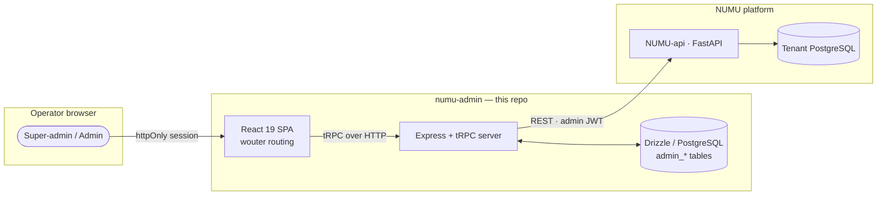
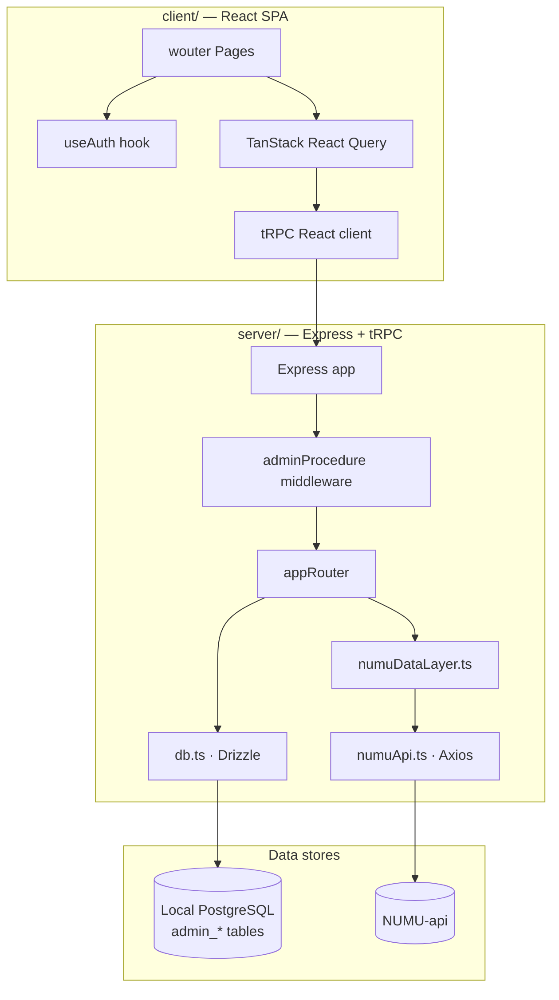
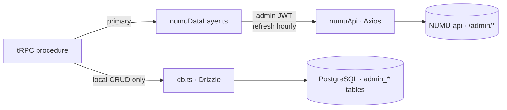
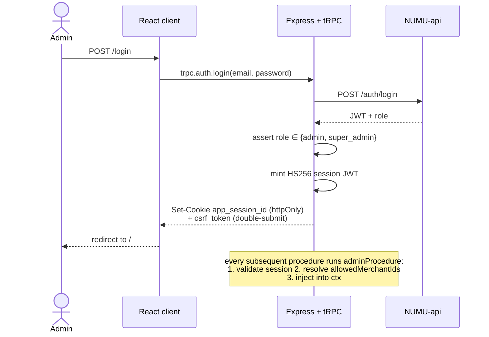

# NUMU Admin Backoffice

The internal **platform admin panel** for the NUMU e-commerce platform. Super-admins manage every merchant, order, and customer across the platform; scoped admins are limited to assigned merchants via RBAC.

A full-stack tRPC application — React 19 client + Express tRPC server, with Drizzle ORM for local CRUD and a thin Axios layer that proxies to `NUMU-api` for the bulk of the data.

---

## Table of contents

- [System context](#system-context)
- [Tech stack](#tech-stack)
- [Application architecture](#application-architecture)
- [Data access — dual strategy](#data-access--dual-strategy)
- [Auth & RBAC](#auth--rbac)
- [tRPC routers](#trpc-routers)
- [Project structure](#project-structure)
- [Getting started](#getting-started)
- [Environment variables](#environment-variables)
- [Conventions](#conventions)

---

## System context



The admin app **does not** reach the merchant or storefront UIs directly — it talks to `NUMU-api` like any other client, plus its own local database for admin-only tables (user accounts, merchant assignments, audit metadata).

---

## Tech stack

| Layer | Choice |
|-------|--------|
| Client framework | React 19 + TypeScript 5.9 |
| Build | Vite 7 |
| Styling | Tailwind CSS 4 · shadcn/ui · Radix |
| Routing | **wouter** (~3.3 kB — *not* react-router-dom) |
| Animation | Framer Motion |
| Server | Express 4 + tRPC v11 |
| Server transform | SuperJSON |
| ORM | Drizzle (PostgreSQL) |
| Auth | HS256 JWT + httpOnly session cookie + CSRF double-submit |
| Package manager | pnpm |

---

## Application architecture



---

## Data access — dual strategy



| Source | Used for |
|--------|----------|
| `numuDataLayer.ts` *(primary)* | All merchant / order / customer / product reads + writes — proxied to `NUMU-api`. Handles admin-token storage and hourly refresh. Enforces tenant scope (super_admin sees all; admin sees only assigned merchants). |
| `db.ts` *(local)* | Admin user accounts, merchant assignments, locally-managed CRUD that doesn't belong in the tenant DB. |

---

## Auth & RBAC



**Sliding session.** If the session JWT is older than 1h on a request, the server quietly re-issues it.

**RBAC scopes:**

| Role | Scope |
|------|-------|
| `super_admin` | sees *all* merchants & data |
| `admin` | sees only merchants in `admin_merchant_assignments` |

Every `adminProcedure` injects `allowedMerchantIds` into context — downstream resolvers must filter on it.

---

## tRPC routers

```text
appRouter
├── auth          login → proxies to NUMU-api, mints session
├── dashboard     stats · revenueByMonth · topMerchants · recentOrders
├── merchants     list · getById · updateStatus · stats
├── orders        list · getById · updateStatus · stats
├── customers     list · stats
├── products      list
└── landingPage   getConfig · updateConfig
```

---

## Project structure

```text
numu-admin/
├── client/
│   ├── public/               # NUMU brand favicon set
│   ├── index.html
│   └── src/
│       ├── pages/            # wouter-routed pages
│       ├── components/       # UI components (shadcn/ui)
│       ├── _core/hooks/      # useAuth + helpers
│       ├── contexts/         # ThemeContext (light/dark)
│       └── lib/              # utils · csrf
├── server/
│   ├── _core/                # Express bootstrap · tRPC setup · auth · CSRF · OAuth
│   ├── routers.ts            # appRouter (auth, dashboard, merchants, …)
│   ├── numuDataLayer.ts      # Primary data access via NUMU-api
│   ├── numuApi.ts            # Axios client
│   └── db.ts                 # Drizzle queries
├── drizzle/
│   └── schema.ts             # 7 admin_* tables
├── shared/                   # Types shared between client + server
├── components.json           # shadcn/ui registry
├── vite.config.ts
└── package.json
```

---

## Getting started

```bash
# 1. Install dependencies
pnpm install

# 2. Configure environment
cp .env.example .env

# 3. Run migrations against local PostgreSQL
pnpm db:push

# 4. Start the dev server (port 5000)
pnpm dev

# 5. Build + preview
pnpm build
pnpm start
```

---

## Environment variables

| Variable | Description |
|----------|-------------|
| `NUMU_API_URL` | NUMU-api base URL (e.g. `http://localhost:8000/api/v1`) |
| `NUMU_ADMIN_EMAIL` | Service account email used to fetch the long-lived admin JWT |
| `NUMU_ADMIN_PASSWORD` | Service account password |
| `DATABASE_URL` | PostgreSQL URL for the admin's local Drizzle schema |
| `SESSION_SECRET` | HS256 signing secret for session JWT (32+ bytes) |
| `VITE_ANALYTICS_ENDPOINT` | (optional) Umami analytics endpoint loaded at runtime |

---

## Conventions

- **wouter, not react-router.** Different API — read its docs before adding routes.
- **Soft Minimalist design.** Warm off-white surfaces, soft shadows, indigo accents. Framer Motion for transitions.
- **All money in cents** — divide by 100 before display.
- **`adminProcedure` is mandatory.** Never expose data without the RBAC middleware applied.
- **Path aliases:** `@/` → `client/src/` · `@shared/` → `shared/`.
